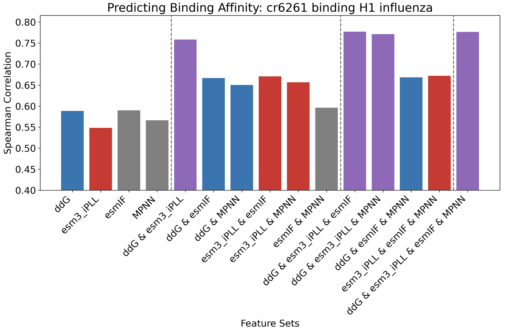

# antibody-KD-prediction
Correlating experimental antibody binding affinity datasets with AI-based and physics-based zero-shot predictors

Predictors:
- [Rosetta ddG](https://github.com/ELELAB/RosettaDDGPrediction)
- esmIF log likelihood (with [public repo](https://github.com/facebookresearch/esm/tree/main/examples/inverse_folding) weights & [Shanker, et. al.](https://github.com/varun-shanker/structural-evolution) weights)
- MPNN score (from [ProteinMPNN](https://github.com/dauparas/ProteinMPNN))
- esm3-large-multimer iPLL (see [repo](https://github.com/evolutionaryscale/esm) and [forge](https://forge.evolutionaryscale.ai/) to use esm3 models)

Datasets:
- [CR6261](https://elifesciences.org/articles/71393) binding to H1 and H9 (influenza proteins)
- [CR9114](https://elifesciences.org/articles/71393) binding to H1 and H3
- [g6](https://doi.org/10.1073/pnas.1613231114) binding to VEGF (deep mutagenesis)

We may add more predictors later, and you can contribute your own as well.  

esm3-large-multimer is a new 98B parameter model by [EvolutionaryScale](https://www.evolutionaryscale.ai/) and its **i**nterface **p**seudo**l**og**l**ikelihood (calculated in a single pass) appears to usefully correlate to binding affinity (KD) in some datasets. It seems to synergize with the other predictors and isn't very correlated to ddG, MPNN score, or esmIF log likelihood (meanwhile MPNN score and esmIF log likelihood are quite correlated).

See the **esm3_iPLL** directory for code to calculate esm3-large-multimer iPLL.  
(We're planning to make the code more user friendly and a tutorial.)  
Note: The esm3-large-multimer model requires an API key.

See the **synergy** directory for datasets of collected predictors, and code to evaluate how the predictors work together.

  
  
Models using esm3 iPLL are red, models using ddG are blue, and models using both are purple.

  

  
  
esm3 iPLL is not highly correlated to the other predictors

## Acknowledgements
Ventura Rivera - coauthor of the esm3 iPLL scripts here.  
EvolutionaryScale team for access of the model, and Neil Thomas for advice/brainstorming.  
Authors of esmIF, ProteinMPNN, Rosetta ddG, and Shanker, et. al. for code to build these datasets.